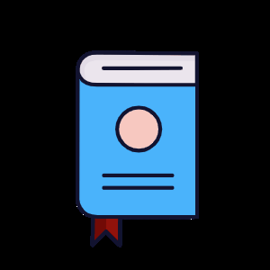
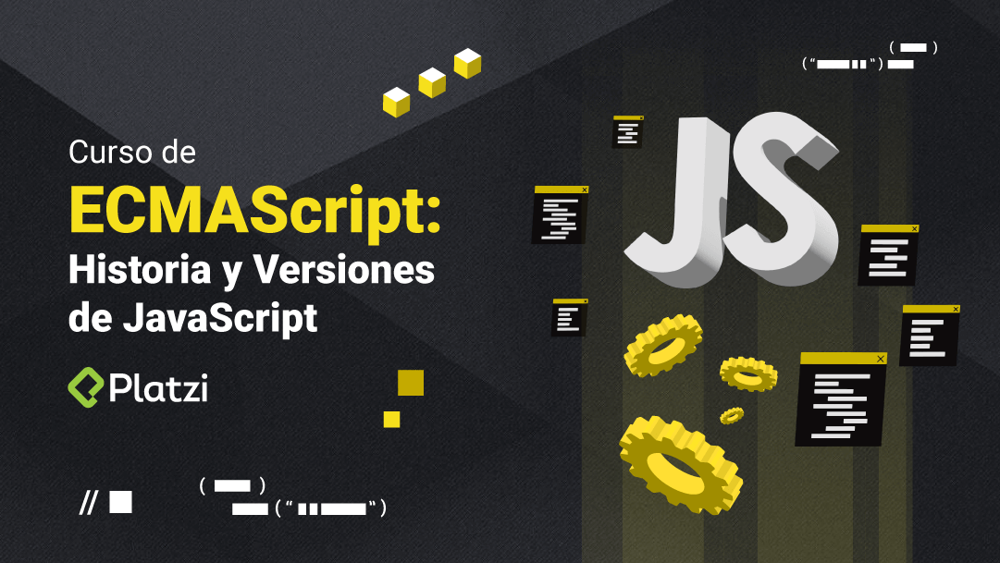
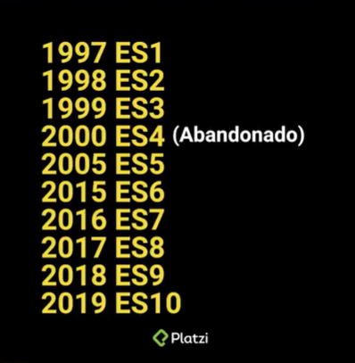

<a name="readme-top"></a>

[![Contributors][contributors-shield]][contributors-url]
[![Forks][forks-shield]][forks-url]
[![Stargazers][stars-shield]][stars-url]
[![Issues][issues-shield]][issues-url]
[![MIT License][license-shield]][license-url]
[![LinkedIn][linkedin-shield]][linkedin-url]

<!-- PROJECT LOGO -->
<br />
<div align="center">
  <a href="https://github.com/ferneynava/Curso-de-ECMAScript">
    
  </a>

  <h3 align="center"><strong>Curso de ECMAScript: Historia y Versiones de JavaScript</strong></h3>
   
  <p align="center">
    JavaScript es el lenguaje más utilizado para desarrollo de aplicaciones web, principalmente en el frontend. Cada año, ECMA International publica una nueva edición de ECMAScript, la especificación a la cual se ajusta JavaScript. Aprende las nuevas características que implementa ECMAScript desde la versión ES6 hasta la versión ES13
<br />
    <a href="https://github.com/ferneynava/Curso-de-ECMAScript"><strong>Explore los documentos »</strong></a>
    <br />
  </p>
</div>

---

## Índice 

- [Índice](#índice)
  - [Introducción](#introducción)
    - [Historia de JavaScript: ¿Qué es ECMAScript?](#historia-de-javascript-¿qué-es-ecmascript)
    - [¿Qué es el TC39?](#¿qué-es-el-tc39)
  - [ECMAScript 6 (ES6 o ES2015)](#ecmascript-6-es6-o-es2015)
    - [Let y const, y arrow function](#let-y-const-y-arrow-function)
    - [Strings](#strings)

<p align="right">(<a href="#readme-top">volvel arriba</a>)</p>

---
### Introducción

#### Historia de JavaScript: ¿Qué es ECMAScript?

**ECMAScript es el estándar que en la actualidad se encarga de regir como debe ser interpretado y funcionar el lenguaje JavaScript, a través de una serie de versiones que añaden funcionalidad nuevas.**

*El primer navegador web:*  
- 1950: Inicio de las computadoras, surguen para analizar temas de la segunda guerra mundial.

- 1969: Se creo la red ARPADET una forma de comunicar dos computadoras, para compartir información.

- 1990: Tim Berners-lee Invento la World Wide Web las bases de la web.

- 1993: Nacimiento de Mosaic primer navegador Web.

- 1994: Marc Andreessen y James H. Clark fundaron Netscape Communications Corporation el primer navegador comercial y que inicio una revolución de la información.

Entre 1995 y 2001, se enfrentaron Netscape y Microsoft para lograr posicionar comercialmente su propio navegador. Quizas Netscape fue el gran perdedor en las guerras de los navegadores es una de las historias más apasaionantes de la crónica de la Red. 

- 1995: Internet Explorer primer navegador web creador por Microsoft. **Mocha** es un lenguaje de programación propuesta creada por Netscape, poco despues sería nombrado **liveScript** y finalmente JavaScript. **JScript** es un lenguaje de programaciónpara la web propuesta creada por Microsoft.  

- 1996: CSS propuesta de estilos creado por Microsoft. 

- 1997: ECMA (*European Computer Manufacturer Association*)  estandarizar múltiples lenguajes de programación surgido por parte de Netscape, Microsoft y otras empresas.

*Evolución de ECMAScript* 

 

<p align="right">(<a href="#índice">⬆ Volver a índice</a>)</p>

--- 
#### ¿Qué es el TC39?

**TC39 grupo de desarrolladores, academicos encargados de revisar y actualizar cada nueva propuesta o funcionalidades, bajo el mando de ECMA. El estándar se caracteriza por una serie de pasos que cada propuesta sigue para publicar en alguna versión de ECMAScript** 

*Etapas de una nueva propuesta para ECMAScript*

- Stage0:  Strawperson (borrador, cualquier persona puede tener una idea para implementar en el estandar)

- Stage1: Proposal (propuesta formal)

- Stage2: Draft (borrador, como va a funcionar la implementacion el impacto entre otros)

- Stage3: Candidate (se elige el candidato, vamos a tener una propuesta que va ayudar a mejorar el lenguaje.)

- Stage4: Finished (va a ser desplegada en la version normalmente en JUNIO)

---
### ECMAScript 6 (ES6 o ES2015)

#### Let y const, y arrow function

**Nueva forma para declarar variables let y const**

Las palabras reservadas **let** y **const** solucionan algunos problemas de **var** tales como el *scope*, *hoisting*, *variables globales*, *re-declaración* y *re-asignación* de variables 

*Variables re-declaradas y re-asignadas*

La re-declaración consiste en volver a declarar una variable, y la re-asignación es volver a asignar un valor a la variable. Cada palabra reservada (*var, let y const*) tiene una forma diferente de utilizar variables. 

 - var: Puede ser re-declarada y re-asignada. 
 - let: No se puede re-declarada pero si re-asignada. 
 - const: No se puede re-declarada, ni re-asignada. 

Al momento de re-declarar una variable con let y const, este producira un error "variable ya declarada"

**Ejemplo de declaración y asignación en diferentes líneas** 

```js
// Declaración de variables 
var nombreVar 
let nombreLet

// Asignación de variables
nombreVar = "Soy Var"
nombreLet = "Soy Let"
```

**Ejemplo de declarar y asignar con const de diferentes líneas de código**

```js
const valorPi
valorPi = 3.14
```

**Ejemplo de re-declaración de variables**

```js
 var nombreVar = "Soy var"
 let nombreLet = "Soy let"
 const nombreConst = "Soy const"


 // Re-declaración de variables
 var nombreVar = "var"
 console.log(nombreVar) // "var"

 let nombreLet = "let" // SyntaxError: Identifier 'nombreLet' has already been declared.

 const nombreConst = "const" //SyntaxError: Identifier 'nombreConst' has already been declared.
```
**Ejemplo de re-asignación de variables**

```js
var nombreVar = "Soy var"
let nombreLet = "Soy let"
const nombreConst = "Soy const"

// Re-asignación de variables
nombreVar = "otro var"
console.log(nombreVar) // "otro var"

nombreLet = "otro let"
console.log(nombreLet) // "otro let"

nombreConst = "Otro const" // TypeError: Assignment to constant variable.
```

*Funciones flecha (arrow functions)*

Consiste en una función anónima. Las funciones anónimas permite no asignarle a un nombre a un conjunto de instrucciones que deseeamos ejecutarlo sin necesidad de asociarlo. 

```js
// Función tradicional

function nombre (parámetros) {
  return valorRetornado
}

// Función flecha

const nombre = (parámetros) => {
  return valorRetornado
}
```

*Omitir paréntesis en las funciones flecha* 

Si en la función existe un solo parámetro, puede omitir los paréntesis.

```js 
const multiplicaciónPorDos = num => {
  return num * 2
}
```

*Retorno implícito* 

Las funciones flecha tienen un retorno implícito, es decir, se puede omitir la palabra reservada **return**, esto con el fin de que el código sea escrito en una sola línea. 

```js
// Función tradicional 
function suma (num1, num2) {
  return num1 + num2
}

// Función flecha
const suma = (num1, num2) => num1 + num2
```

Si se requiere de más lineas y desea utilizarlo de una manera implícita, deberás envolver el cuerpo de la función entre paréntesis. 

```js
const suma = (num1, num2) => (
  num1 + num2 
)
```
---

#### Strings

*Concatenación de caracteres* 

Para crear una cadena larga, se puede utilizar la concatenación. Consiste en unir uno o varios caracteres,utilizando el signo de suma. 

```js
var nombre = "Ferney"
var edad = 26
var mensaje = "Mi nombre es " + nombre " y tengo " + edad + " años."

console.log(mensaje) // "Mi nombre es Ferney y tengo 26 años." 
```

*Cómo utilizar las plantillas literales*

Se emplea el caracter acento grave (`) y para incluir las variables se utiliza la sintaxis ```${variable}```

```js
var nombre = "Ferney"
var edad = 26

var mensaje = `Mi nombre es ${nombre} y tengo ${edad} años.`
console.log(mensaje) // "Mi nombre es Ferney y tengo 26 años." 
```

*Plantilla multilínea*

Consiste en crear mensajes que contengan varias líneas separadas entre si, utilizando las plantillas literales. Antes la forma de crear una plantilla multilínea es agregando \n al string. 

```js
var mensaje = "Línea 1 \n" + "línea 2"

console.log(mensaje)
// 'Línea 1 
// línea 2'
```

Con ES6 solo se necesita utilizar las plantillas literales 


```js
var mensaje = `Línea 1
línea 2`

console.log(mensaje)
// 'Línea 1 
// línea 2'
```

## Getting Started

This is an example of how you may give instructions on setting up your project locally.
To get a local copy up and running follow these simple example steps.

### Prerequisites

This is an example of how to list things you need to use the software and how to install them.
* npm
  ```sh
  npm install npm@latest -g
  ```

### Installation

_Below is an example of how you can instruct your audience on installing and setting up your app. This template doesn't rely on any external dependencies or services._

1. Get a free API Key at [https://example.com](https://example.com)
2. Clone the repo
   ```sh
   git clone https://github.com/your_username_/Project-Name.git
   ```
3. Install NPM packages
   ```sh
   npm install
   ```
4. Enter your API in `config.js`
   ```js
   const API_KEY = 'ENTER YOUR API';
   ```

<p align="right">(<a href="#readme-top">back to top</a>)</p>


<!-- USAGE EXAMPLES -->
## Usage

Use this space to show useful examples of how a project can be used. Additional screenshots, code examples and demos work well in this space. You may also link to more resources.

_For more examples, please refer to the [Documentation](https://example.com)_

<p align="right">(<a href="#readme-top">back to top</a>)</p>


<!-- ROADMAP -->
## Roadmap

- [x] Add Changelog
- [x] Add back to top links
- [ ] Add Additional Templates w/ Examples
- [ ] Add "components" document to easily copy & paste sections of the readme
- [ ] Multi-language Support
    - [ ] Chinese
    - [ ] Spanish

See the [open issues](https://github.com/othneildrew/Best-README-Template/issues) for a full list of proposed features (and known issues).

<p align="right">(<a href="#readme-top">back to top</a>)</p>


<!-- CONTRIBUTING -->
## Contributing

Contributions are what make the open source community such an amazing place to learn, inspire, and create. Any contributions you make are **greatly appreciated**.

If you have a suggestion that would make this better, please fork the repo and create a pull request. You can also simply open an issue with the tag "enhancement".
Don't forget to give the project a star! Thanks again!

1. Fork the Project
2. Create your Feature Branch (`git checkout -b feature/AmazingFeature`)
3. Commit your Changes (`git commit -m 'Add some AmazingFeature'`)
4. Push to the Branch (`git push origin feature/AmazingFeature`)
5. Open a Pull Request

<p align="right">(<a href="#readme-top">back to top</a>)</p>


<!-- LICENSE -->
## License

Distributed under the MIT License. See `LICENSE.txt` for more information.

<p align="right">(<a href="#readme-top">back to top</a>)</p>


<!-- CONTACT -->
## Contact

Your Name - [@your_twitter](https://twitter.com/your_username) - email@example.com

Project Link: [https://github.com/your_username/repo_name](https://github.com/your_username/repo_name)

<p align="right">(<a href="#readme-top">back to top</a>)</p>


<!-- ACKNOWLEDGMENTS -->
## Acknowledgments

Use this space to list resources you find helpful and would like to give credit to. I've included a few of my favorites to kick things off!

* [Choose an Open Source License](https://choosealicense.com)
* [GitHub Emoji Cheat Sheet](https://www.webpagefx.com/tools/emoji-cheat-sheet)
* [Malven's Flexbox Cheatsheet](https://flexbox.malven.co/)
* [Malven's Grid Cheatsheet](https://grid.malven.co/)
* [Img Shields](https://shields.io)
* [GitHub Pages](https://pages.github.com)
* [Font Awesome](https://fontawesome.com)
* [React Icons](https://react-icons.github.io/react-icons/search)

<p align="right">(<a href="#readme-top">back to top</a>)</p>


<!-- MARKDOWN LINKS & IMAGES -->
<!-- https://www.markdownguide.org/basic-syntax/#reference-style-links -->
[contributors-shield]: https://img.shields.io/github/contributors/ferneynava/Curso-de-ECMAScript.svg?style=for-the-badge
[contributors-url]: https://github.com/ferneynava/Curso-de-ECMAScript/graphs/contributors
[forks-shield]: https://img.shields.io/github/forks/ferneynava/Curso-de-ECMAScript.svg?style=for-the-badge
[forks-url]: https://github.com/ferneynava/Curso-de-ECMAScript/network/members
[stars-shield]: https://img.shields.io/github/stars/ferneynava/Curso-de-ECMAScript.svg?style=for-the-badge
[stars-url]: https://github.com/ferneynava/Curso-de-ECMAScript/stargazers
[issues-shield]: https://img.shields.io/github/issues/ferneynava/Curso-de-ECMAScript.svg?style=for-the-badge
[issues-url]: https://github.com/ferneynava/Curso-de-ECMAScript/issues
[license-shield]: https://img.shields.io/github/license/ferneynava/Curso-de-ECMAScript.svg?style=for-the-badge
[license-url]: https://github.com/ferneynava/Curso-de-ECMAScript/blob/master/LICENSE.txt
[linkedin-shield]: https://img.shields.io/badge/-LinkedIn-black.svg?style=for-the-badge&logo=linkedin&colorB=555
[linkedin-url]: https://www.linkedin.com/in/ferney-alexander-nava-trujillo-0478a8118/
[product-screenshot]: images/screenshot.png
